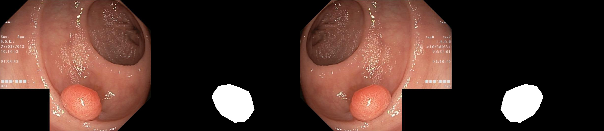
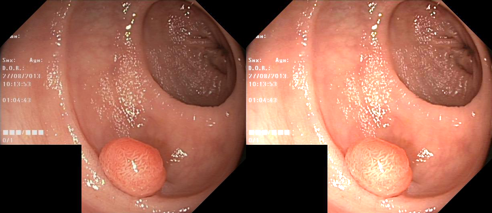
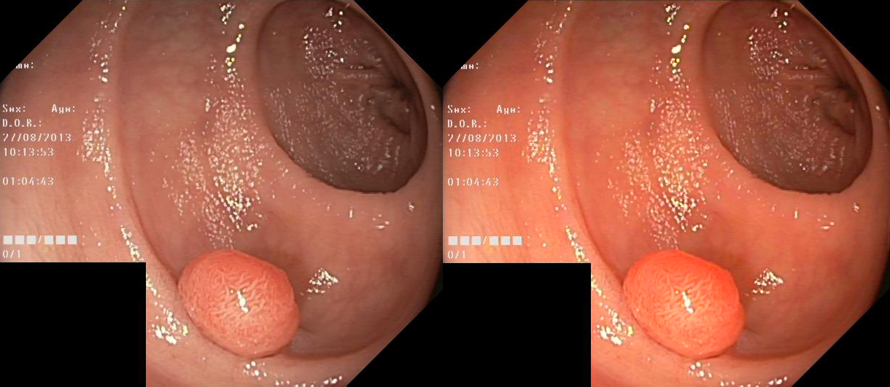
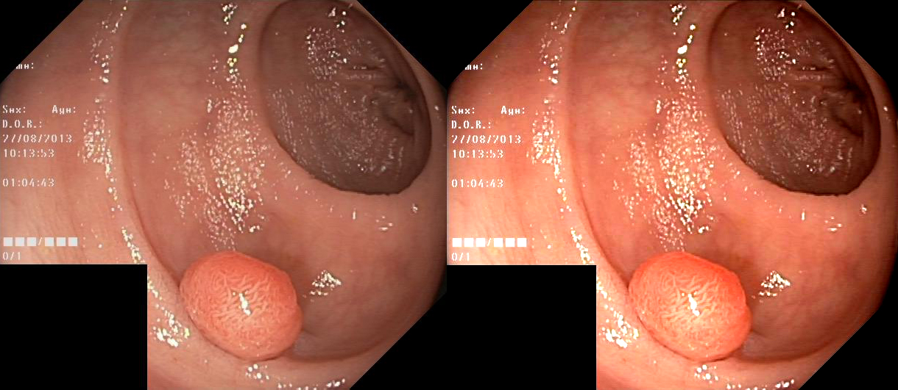
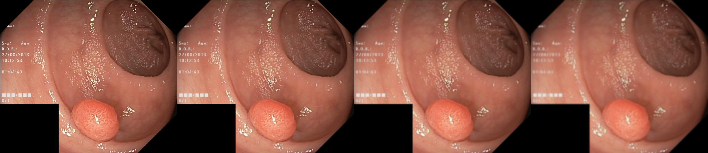
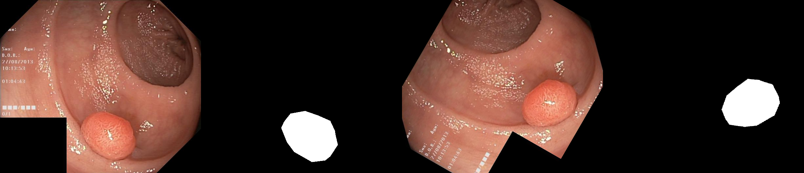

# Data-Augmentation
仓库主要包括了一些简单的数据增强手段

### 依赖
#### opencv 4.0.1
#### numpy 1.21.2

## 已实现
#### 1.裁剪   [crop.py](https://github.com/yc096/Data-Augmentation/blob/main/aug_function/crop.py)
#### 2.翻转   [flip.py](https://github.com/yc096/Data-Augmentation/blob/main/aug_function/flip.py)
#### 3.更改亮度   [adjust_brightness.py](https://github.com/yc096/Data-Augmentation/blob/main/aug_function/adjust_brightness.py)
#### 4.更改饱和度  [adjust_saturation.py](https://github.com/yc096/Data-Augmentation/blob/main/aug_function/adjust_saturation.py)
#### 5.更改对比度  [adjust_contrast.py](https://github.com/yc096/Data-Augmentation/blob/main/aug_function/adjust_contrast.py)
#### 6.按尺度缩放 [scale.py](https://github.com/yc096/Data-Augmentation/blob/main/aug_function/scale.py)
#### 7.高斯模糊 [gaussianblur.py](https://github.com/yc096/Data-Augmentation/blob/main/aug_function/gaussianblur.py)
#### 8.标准化/反标准化 [normalize.py](https://github.com/yc096/Data-Augmentation/blob/main/aug_function/normalize.py)
#### 9.旋转   [rotate.py](https://github.com/yc096/Data-Augmentation/blob/main/aug_function/rotate.py)

## Demo
### 1.裁剪

### 2.翻转

### 3.调增亮度  x1.5

### 4.调增饱和度 x1.5

### 5.调增对比度 x1.5

### 6.按尺度缩放 x0.85

### 7.高斯模糊 原图 k=3 k=7 k=11

### 8.标准化/反标准化

### 9.旋转 60°
